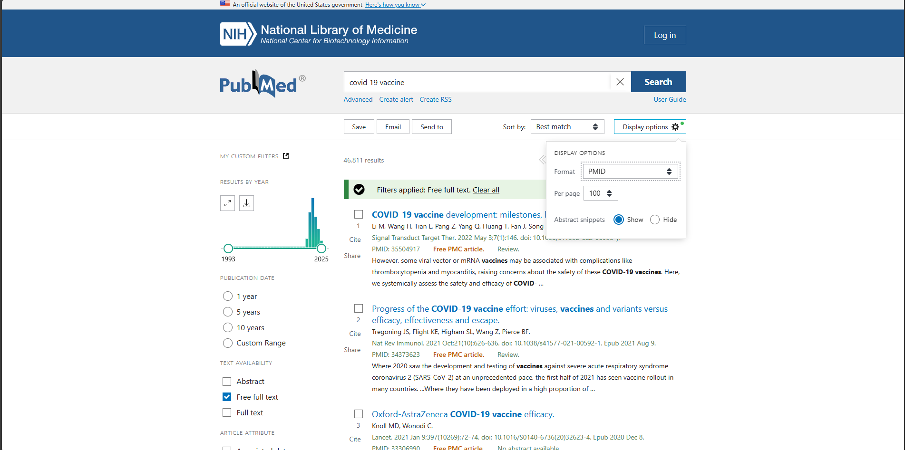
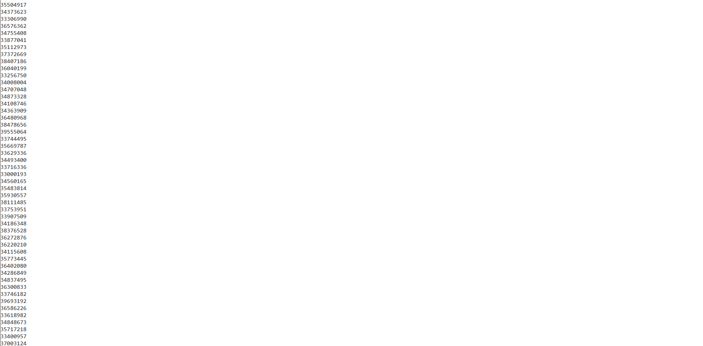

# Matt's PaperToData Program 

This python program, developed by Matt Ataso in He Lab, takes inputs of PMIDs in csv, space seperated, or manual inputs. The program outputs a vaccine csv with fields:
- pmcid
- vaccine_name
- vaccine_target_pathogen 
- vaccine_target_host
- vaccine_model_host 
- vaccine_delivery_method
- vaccine_manufacturer 
- vaccine_storage_method
- vaccine_stage 
- vaccine_license 
- vaccine_antigen 
- vaccine_formulation 

The program utilizes LLMs to parse and read full-legnth papers and retrieves the specific fields.
## Table of Contents 
- [Installation](#installation) 
- [Usage](#usage) 
- [Example](#example) 

## Installation
1. Clone the repository: 
```bash 
> git clone https://github.com/Hegroup-Bioinformatics/PaperToData.git
```

2. Install dependencies:
```bash
> pip install -r requirements.txt
```

3. Setup .env files:  

	- langchain.env 
	- llm.env

	Make sure that the fields are encapsulated as strings:
	```cpp
	FIELD_NAME="value_here"
	```

	### langchain.env
	```cpp
	LANGCHAIN_ENDPOINT={YOUR_ENDPOINT}
	LANGCHAIN_TRACING="true" 			//default is true
	LANGCHAIN_API_KEY={YOUR_API_KEY}
	```
	### llm.env
	```cpp
	DEPLOYMENT={MODEL_NAME} 			// gpt-4o-mini is good
	API_VERSION={VERSION} 				// 2024-06-01 is good
	API_KEY={YOUR_API_KEY}
	ENDPOINT={YOUR_ENDPOINT}
	ORGANIZATION={YOUR_ORGANIZATION} 
	```

## Usage
To run the program:
```cpp
> python3 ./mainCSV.py     		
```
If python3 does not work:
```cpp
> python ./mainCSV.py
```
When running the program you will be prompted to enter a file for the output csv in the data folder. Then you will choose an input method, and lastly, a input file location if you choose csv or space seperated.  
Your file structure should look like this:
```cpp
PaperToData/
	data/
	  └──data.csv					 //must be csv
	pmid_input/
		└──input.csv         //for space seperated, can be txt
```
PaperToData makes a folder for raw_xml, storing all retrieved articles, it is not necessary to keep them after program runs but is helpful for debugging.

## Example 
In this example we will use PudMed to retrieve 100 PMIDs for articles related to covid-19 vaccine.
Pressing display options can enable you to select the number per page as well as format. Select PMID in the dropdown menu.



After you should get this:



Copy these values and put them into a txt in the pmid_input folder.
Make sure that there is a valid csv in the data folder.

Run the program:
```cpp
	> python3 ./mainCSV.py
	Welcome to Paper to Neo4j
	Model Loaded 

	Langchain Loaded 
	Enter a csv in data folder
	> test.csv
	Choose input method: csv, space sperated values, manual input, enter c, s, or m
	> s
	Enter the name of the file in pmid input folder
	> input.txt
```


After the program starts running, you should see a stream of data in the terminal. You can see the entries being made in real time in your output file.
